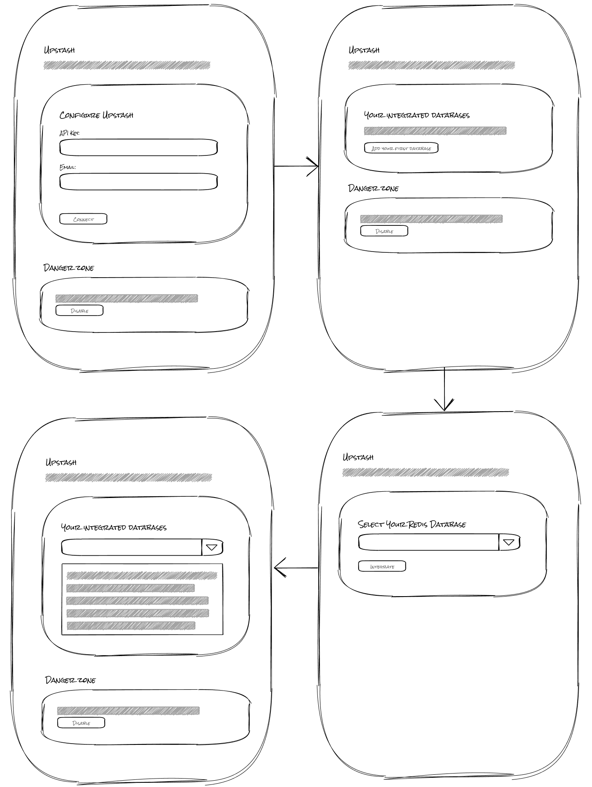

# Upstash <-> Netlify Integration

## Aims of the integration

Make it simple for developers to use Upstash on an site hosted on Netlify and provide useful code snippets that use the environment variables we will create automatically once connecting to a users' Upstash account.

## How will this integration work?

For this integration the flow should be relatively simple.

1. Collect the users’ Upstash API key and email address and store it
2. Create a flow for the user to select and integrate with an Upstash Redis database. This will trigger the logic to create all the necessary environment variables to connect to this database
3. Once an Upstash Redis database has been integrated with, the user will be able to copy code snippets that show them how to connect to that database instance via their application

## Defining our integration context

As we will be storing the users' Upstash configuration with the [Integration API](https://sdk.netlify.com/integration-api/), we need to define the shape of our integration context and we do this by creating a [zod](https://zod.dev/) schema to define the shape of this context. For this integration, our config will be relatively simple and can be found [here](./src/index.ts#L12)

We can then define a [type definition](./src/index.ts#L26) that all of our API handlers will use, so that when using the context argument we know what the object will look like.

## Our routes

Based on the designs, we are going to have two routes:

1. Root integration page - `/`
2. Integrate database page - `/integrate-database`

The root integration page will be the page where the user lands when they enable your integration. For this example it would be, `https://app.netlify.com/sites/<site-name>/integrations/database/upstash`.

The `/integration-database` route is where users will land when they have clicked the CTA to add a new database to the integration, taking them to: `https://app.netlify.com/sites/<site-name>/integrations/database/upstash/integrate-database`.

## Connecting to Upstash

In our `/` route, we need to collect the API key and email address of the user for Upstash. This is where we make use of the [components](https://sdk.netlify.com/integration-ui/add-elements/) made available to use with the Netlify SDK. We use these components to collect the users' Upstash configuration using a [form](./src/ui/routes/root.ts#L76), which will then make a call to an API handler we will create in the next step.

## Adding API handlers

Next we [add](./src/handlers/connect.ts) and [register](./src/index.ts#L48) an API handler to receive the configuration from the above form with the `integration.addApiHandler()` method and make use of the NetlifyIntegrationClient that is made available in the context argument that is passed to our API handlers.

We call this API handler from the configuration form we created and refresh the page once we get an `ok` response from the API handler.

## Navigating to a new route

Once a user has connected to their Upstash account via the integration, we are able to create a call to action (CTA) to navigate users to a new route to start integrating with their Upstash Redis database. This means, we need to conditionally render elements on the page based on whether the user is connected or not. The `Add database` CTA is placed within a [card](./.src/ui/routes/root.ts#L165), but we keep the display property of this element set to `hidden` so that we can add some logic in the next step to show this conditionally. We also make our `connect-form` hidden by default too.

## Integrating with a database

In our `/integrate-database` route, we allow users to select from a dropdown of their Redis databases they have created in Upstash. We add a form with an id of `integrate-form` with a [select](./src/ui/routes/integrate-database.ts#L76) field that will hold the databases the user can integrate with. As with our `/` route, this route will also need an `onLoad` [function](./src/ui/routes/integrate-database.ts#L10) to populate this select field with databases from the users’ Upstash account.

The `onLoad` makes a call to a [new API handler](./src/handlers/getDatabases.ts) called `get-databases` which contains the logic to use our saved integration context to make an authenticated call to Upstash to get the users' Redis databaes. The response is then use to [populate the options](./src/handlers/getDatabaes.ts#L19) in the select field.

When we submit our `integrate-form`, we can effectively integrate the database by saving the Upstash endpoint and token as environment variables for the user and storing the `id` of the database we have integrated within our integration context. This is achieved by [calling another API handler](./src/ui/routes/integrate-database.ts#L60) called `integrate` which is responsible for updating our integration context and saving the environment variables.

## Wiring it all together

Now that we’ve built the flow for integrating with a users’ Upstash databases, we can give them helpful code snippets in the integration UI. This will help guide users in quickly making use of the integration and the environment variables we have created. We add a [dropdown](./src/ui/routes/root.ts#L172) in our `/` route which will show all of the integrated caches and when an option is selected from this dropdown, we make our [code snippet element](./src/ui/routes/root.ts#L207) visible.

## And that's it

TODO - Add DTN button, links to docs and ways to test out the integration
